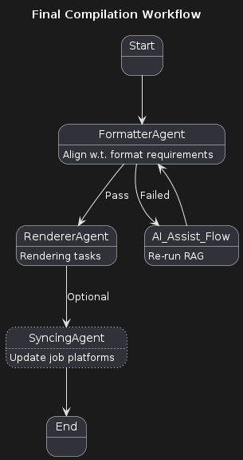

<!-- PROJECT LOGO -->
<div>
  <h1 align="center">ResumeAssist: Your private resume guide </h1>
<div>
  
 

[](https://codecov.io/gh/Criss-Wang/ResumeAssist)
[](https://www.python.org/downloads/release/python-3110/)
[](https://opensource.org/licenses/Apache-2.0)
[](https://github.com/criss-wang/ResumeAssist/commits/master)

**Introducing ResumeAssist, an easy-to-deploy personal resume assistant with UNLIMITED AI suggestions.**


## ⚡ Getting Started
The easiest way to run ResumeAssist is inside a Docker container. It works with Linux, Mac OS, or WSL on Windows.

To start ResumeAssist in a docker container, run the following commands in your terminal:

```bash
Docker command to come soon
```

## 💻 Tech Stack
- **UI**: TypeScript, Next.js, React, Tailwind CSS, MateriaUI

- **Backend**: Fastapi, Neo4j, Docker, 

- **LLM**: LangChain, Jupyter, OpenAI

## 🚀 Documentation
Prototyping... So far you may refer to the following:
### Major Flow


### Main execution paths
<P>
  
</P>
<p>
  
</P>


## 📈 Roadmap
### Major updates
- This is a renewed effort of my instruction-based resume assist which started after my Master's Degree. I decided to overhaul the repo, and replace the simple llm-call with a more flexible, multi-agent AI assistant system.
### Completed
- Anthropic based LangChain engine
- Config-based Agent system
- Basic UI for Resume modification
- Unit Testing
- Linting
- Neo4j connection
- - CV Rendering
- Integration (Frontend & Backend)

### In progress
- Multiple
- LLM Observability (online evaluation with langfuse & deepeval)
- GraphRAG

### Planned
- Make UI look better
- Ollama based LangChain engines (True unlimited use)
- Local Model (if GPU is available, may use quantized models)


